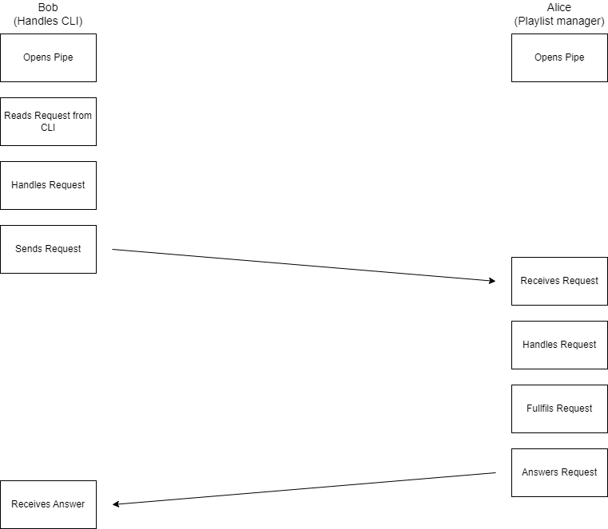

# Guião 7 (Extra): Comunicação entre processos usando pipes

 

## Introdução ao **Serenader**

1. Clone este repositório, usando o git: `git clone https://github.com/tecnico-so/???`
2. Este exercício consiste no desenvolvimento da comunicação por pipes entre dois processos: Bob e Alice.
 
3. Estude o ficheiro `bob/bob.c`, no qual o processo Bob ciclicamente lê os pedidos escritos na **linha de comandos** (`CLI`) e os comunica para o processo Alice através de um **named pipe** distinguindo-os através dos seguintes **opcodes** (`include/proto.h`):
```c
typedef enum prot_code_t {
    PROT_CODE_PLAY = 1,
    PROT_CODE_STOP = 2,
    PROT_CODE_PAUSE = 3,
    PROT_CODE_REPEAT = 4,
    PROT_CODE_SHUFFLE = 5,
    PROT_CODE_SERENADE = 6,
    PROT_CODE_GOODBYE = 7,
    PROT_CODE_FATAL_ERROR = 0xfffe,
    PROT_CODE_ERROR = 0xffff,
} prot_code_t;
```
4. Estude o ficheiro `alice/alice.c`, no qual o processo Alice ciclicamente recebe pedidos num named pipe e executa as funções descritas nestes.
5. Repare no ficheiro `lib/proto.c`, no qual é necessário implementar as funções `prot_send` e `prot_recv`.
6. Repare no ficheiro `lib/fifo.c`, no qual é necessário implementar as funções `open_send_fifo` e `open_recv_fifo`.

## Exercício base

1. Implemente as funções necessárias para tornar o **Serenader** funcional.

## Exercícios extra

1. Adicione uma funcionalidade `NEXT`, que consiste em adicionar a capacidade de saltar para a música seguinte.
2. Adicione uma funcionalidade `KILL`, que consiste em adicionar a capacidade de parar a Alice de correr.
